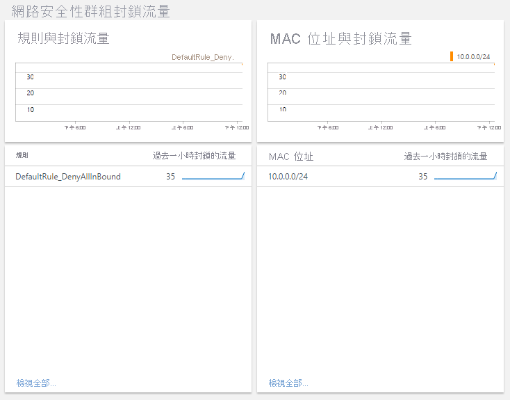
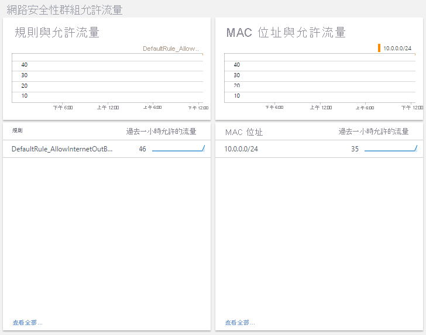

# <a name="azure-networking-monitoring-solutions-in-azure-monitor"></a>Azure 監視器中的 Azure 網路監視解決方案

[!INCLUDE [updated-for-az](../../../includes/updated-for-az.md)]

Azure 監視器提供下列解決方案來監視網路：
* 網路效能監視器 (NPM) 以
    * 監視網路的健康狀態
* 要檢閱的 Azure 應用程式閘道分析
    * Azure 應用程式閘道記錄
    * Azure 應用程式閘道計量
* 監視和稽核雲端網路上網路活動的解決方案
    * [流量分析](../../networking/network-monitoring-overview.md#traffic-analytics) 
    * Azure 網路安全性群組分析

## <a name="network-performance-monitor-npm"></a>網路效能監視器 (NPM)

[網路效能監視器](../../networking/network-monitoring-overview.md)管理解決方案是網路監視解決方案，可監視網路的健康狀態、可用性和連線能力。  可用來監視下列項目之間的連線能力︰

* 公用雲端與內部部署環境
* 資料中心與使用者地點 (分公司)
* 裝載多層式應用程式各層的子網路。

如需詳細資訊，請參閱[網路效能監視器](../../networking/network-monitoring-overview.md)。

## <a name="network-security-group-analytics"></a>網路安全性群組分析

1. 將管理解決方案新增至 Azure 監視器，以及
2. 啟用診斷功能以將診斷導向至 Azure 監視器中的 Log Analytics 工作區。 不需要將記錄寫入 Azure Blob 儲存體。

如果未啟用診斷記錄，該資源的儀表板 blade 會是空白，並顯示錯誤訊息。

## <a name="azure-application-gateway-analytics"></a>Azure 應用程式閘道分析

1. 啟用診斷功能以將診斷導向至 Azure 監視器中的 Log Analytics 工作區。
2. 使用應用程式閘道的活頁簿範本，取用資源的詳細摘要。

如果未啟用應用程式閘道的診斷記錄，則只會在活頁簿內填入預設的度量資料。


> [!NOTE]
> 從 2017 年 1 月開始，從應用程式閘道和網路安全性群組傳送記錄到 Log Analytics 工作區的支援方式已變更。 如果您看到 **Azure 網路分析 (已過時)** 解決方案，請參閱 [從舊的網路分析解決方案進行移轉](#migrating-from-the-old-networking-analytics-solution)，以取得您必須遵循的步驟。
>
>

## <a name="review-azure-networking-data-collection-details"></a>檢閱 Azure 網路資料集合詳細資料
Azure 應用程式閘道分析和網路安全性群組分析管理解決方案，會直接從 Azure 應用程式閘道和網路安全性群組收集診斷記錄。 不需要將記錄寫入 Azure Blob 儲存體，也不需要代理程式來收集資料。

下表顯示資料收集方法，與其他有關如何針對 Azure 應用程式閘道分析和網路安全性群組分析收集資料的詳細資料。

| 平台 | 直接代理程式 | Systems Center Operations Manager 代理程式 | Azure | 是否需要 Operations Manager？ | 透過管理群組傳送的 Operations Manager 代理程式資料 | 收集頻率 |
| --- | --- | --- | --- | --- | --- | --- |
| Azure |  |  |&#8226; |  |  |登入時 |


### <a name="enable-azure-application-gateway-diagnostics-in-the-portal"></a>在入口網站中啟用 Azure 應用程式閘道診斷

1. 在 Azure 入口網站中，巡覽至要監視的應用程式閘道資源。
2. 選取 [ *診斷設定* ] 以開啟下列頁面。

   

   [](media/azure-networking-analytics/application-gateway-diagnostics-2.png#lightbox)

5. 按一下 [傳送到 Log Analytics] 核取方塊。
6. 選取現有的 Log Analytics 工作區，或建立工作區。
7. 針對每一個要收集的記錄類型，按一下 [記錄] 下的核取方塊。
8. 按一下 [儲存] 以啟用 Azure 監視器的診斷記錄。

#### <a name="enable-azure-network-diagnostics-using-powershell"></a>使用 PowerShell 啟用 Azure 網路診斷

下列 PowerShell 指令碼示範如何啟用應用程式閘道的資源記錄。

```powershell
$workspaceId = "/subscriptions/d2e37fee-1234-40b2-5678-0b2199de3b50/resourcegroups/oi-default-east-us/providers/microsoft.operationalinsights/workspaces/rollingbaskets"

$gateway = Get-AzApplicationGateway -Name 'ContosoGateway'

Set-AzDiagnosticSetting -ResourceId $gateway.ResourceId  -WorkspaceId $workspaceId -Enabled $true
```

#### <a name="accessing-azure-application-gateway-analytics-via-azure-monitor-network-insights"></a>透過 Azure 監視器 Network insights 存取 Azure 應用程式閘道分析

您可以透過應用程式閘道資源中的 [見解] 索引標籤來存取 application insights。


[View 詳細計量] 索引標籤會開啟預先填入的活頁簿，摘要列出來自您應用程式閘道的資料。

[](media/azure-networking-analytics/application-gateway-workbook.png#lightbox)

## <a name="migrating-from-azure-gateway-analytics-solution-to-azure-monitor-workbooks"></a>從 Azure 閘道分析解決方案遷移至 Azure 監視器活頁簿

> [!NOTE]
> Azure 監視器 Network Insights 活頁簿是針對應用程式閘道資源存取計量和 log analytics 的建議解決方案。

1. 確定 [已啟用診斷設定](#enable-azure-application-gateway-diagnostics-in-the-portal) ，以將記錄儲存至 Log Analytics 工作區。 如果已設定，Azure 監視器 Network Insights 活頁簿將能夠取用相同位置的資料，而且不需要進行任何其他變更。

> [!NOTE]
> 所有過去的資料都已在活頁簿中，從最初啟用的點診斷設定開始使用。 不需要進行資料傳輸。

2. 存取應用程式閘道資源的 [預設深入](#accessing-azure-application-gateway-analytics-via-azure-monitor-network-insights) 解析活頁簿。 應用程式閘道分析解決方案所支援的所有現有見解都將存在於活頁簿中。 您可以根據度量 & 記錄資料來新增自訂 [視覺效果](../platform/workbooks-overview.md#visualizations) ，以擴充此項。

3. 當您可以看到所有計量和記錄深入解析之後，若要從您的工作區清除 Azure 閘道分析解決方案，您可以從解決方案資源頁面刪除解決方案。

[![Azure 應用程式閘道分析解決方案的 [刪除] 選項的螢幕擷取畫面。](media/azure-networking-analytics/azure-appgw-analytics-delete.png)](media/azure-networking-analytics/application-gateway-analytics-delete.png#lightbox)

### <a name="new-capabilities-with-azure-monitor-network-insights-workbook"></a>Azure 監視器 Network Insights 活頁簿的新功能

> [!NOTE]
> Azure 監視器 Insights 活頁簿沒有相關聯的額外成本。 Log Analytics 工作區將繼續依使用量計費。

網路深入解析活頁簿可讓您利用 Azure 監視器與 Log Analytics 的最新功能，包括：

* 集中式主控台，可用於監視和疑難排解 [計量和記錄](../insights/network-insights-overview.md#resource-health-and-metrics) 資料。

* 彈性的畫布，可支援建立自訂豐富的 [視覺效果](../platform/workbooks-overview.md#visualizations)。

* 可以取用和共用更多的小組的活頁 [簿範本](../platform/workbooks-overview.md#workbooks-versus-workbook-templates) 。

若要尋找新活頁簿方案功能的詳細資訊，請參閱活頁 [簿-總覽](../platform/workbooks-overview.md)

## <a name="azure-network-security-group-analytics-solution-in-azure-monitor"></a>Azure 監視器中的 Azure 網路安全性群組分析解決方案


> [!NOTE]
> 網路安全性群組分析解決方案將會移至社群支援，因為其功能已由[流量分析](../../network-watcher/traffic-analytics.md)取代。
> - 解決方案現已在 [Azure 快速入門範本](https://azure.microsoft.com/resources/templates/oms-azurensg-solution/)中提供，而且將很快不再於 Azure Marketplace 中提供。
> - 對於已將此解決方案新增至其工作區的現有客戶，它會繼續運作而不需要變更。
> - Microsoft 將繼續支援使用診斷設定，將 NSG 資源記錄傳送至工作區。

網路安全性群組支援下列記錄︰

* NetworkSecurityGroupEvent
* NetworkSecurityGroupRuleCounter

### <a name="install-and-configure-the-solution"></a>安裝和設定解決方案
使用下列指示來安裝和設定 Azure 網路分析解決方案︰

1. 使用[從方案庫新增 Azure 監視器解決方案](./solutions.md)中所述的程序，以啟用 Azure 網路安全性群組分析解決方案。
2. 針對您想要監視的[網路安全性群組](../../virtual-network/virtual-network-nsg-manage-log.md)資源啟用診斷記錄。

### <a name="enable-azure-network-security-group-diagnostics-in-the-portal"></a>在入口網站中啟用 Azure 網路安全性群組診斷

1. 在 Azure 入口網站中，瀏覽至要監視的網路安全性群組資源
2. 選取 [診斷記錄] 以開啟下列頁面

   ![網路安全性群組資源 [診斷記錄] 頁面的螢幕擷取畫面，其中顯示開啟診斷的選項。](media/azure-networking-analytics/log-analytics-nsg-enable-diagnostics01.png)
3. 按一下 [開啟診斷] 以開啟下列頁面

   ![設定診斷設定頁面的螢幕擷取畫面。 [狀態] 設為 [開啟]，並選取 [傳送至 Log Analytics]，並選取兩個記錄類型。](media/azure-networking-analytics/log-analytics-nsg-enable-diagnostics02.png)
4. 若要開啟診斷，請按一下 [狀態] 下的 [開啟]
5. 按一下 [傳送到 Log Analytics] 核取方塊
6. 選取現有的 Log Analytics 工作區，或建立工作區
7. 針對每一個要收集的記錄類型，按一下 [記錄] 下的核取方塊
8. 按一下 [儲存] 以啟用 Log Analytics 的診斷記錄

### <a name="enable-azure-network-diagnostics-using-powershell"></a>使用 PowerShell 啟用 Azure 網路診斷

下列 PowerShell 指令碼示範如何啟用網路安全性群組的資源記錄
```powershell
$workspaceId = "/subscriptions/d2e37fee-1234-40b2-5678-0b2199de3b50/resourcegroups/oi-default-east-us/providers/microsoft.operationalinsights/workspaces/rollingbaskets"

$nsg = Get-AzNetworkSecurityGroup -Name 'ContosoNSG'

Set-AzDiagnosticSetting -ResourceId $nsg.ResourceId  -WorkspaceId $workspaceId -Enabled $true
```

### <a name="use-azure-network-security-group-analytics"></a>使用 Azure 網路安全性群組分析
在您按一下 [概觀] 上的 [Azure 網路安全性群組分析] 圖格之後，您可以檢視記錄摘要，然後深入探索下列類別的詳細資訊：

* 網路安全性群組封鎖流量
  * 網路安全性群組規則與封鎖流量
  * MAC 位址與封鎖流量
* 網路安全性群組允許流量
  * 網路安全性群組規則與允許流量
  * MAC 位址與允許流量





在 [Azure 網路安全性群組分析] 儀表板上，檢閱其中一個刀鋒視窗中的摘要資訊，然後按一下其中一個以在記錄搜尋頁面中檢視詳細資訊。

您可以在任何 [記錄搜尋] 頁面上，按時間、詳細結果和您的記錄搜尋記錄來檢視結果。 您也可以按 Facet 篩選以縮減結果。

## <a name="migrating-from-the-old-networking-analytics-solution"></a>從舊的網路分析解決方案進行移轉
從 2017 年 1 月開始，從 Azure 應用程式閘道和 Azure 網路安全性群組傳送記錄到 Log Analytics 工作區的支援方式已變更。 這些變更可提供下列優點︰
+ 記錄會直接寫入 Azure 監視器，而不需要使用儲存體帳戶
+ 當 Azure 監視器中具有產生的記錄時，延遲會變得較低
+ 較少的組態步驟
+ 所有 Azure 診斷類型的通用格式

若要使用更新的解決方案：

1. [將診斷設定為直接從 Azure 應用程式閘道傳送到 Azure 監視器](#enable-azure-application-gateway-diagnostics-in-the-portal)
2. [將診斷設定為直接從 Azure 網路安全性群組傳送到 Azure 監視器](#enable-azure-network-security-group-diagnostics-in-the-portal)
2. 使用[從方案庫新增 Azure 監視器解決方案](solutions.md)中所述的程序來啟用「Azure 應用程式閘道分析」和「Azure 網路安全性群組分析」解決方案
3. 更新任何已儲存的查詢、儀表板或警示，以使用新的資料類型
   + 類型是 AzureDiagnostics。 您可以使用 ResourceType 來篩選 Azure 網路記錄。

     | 不要這樣撰寫： | 使用︰ |
     | --- | --- |
     | NetworkApplicationgateways &#124; 其中 OperationName=="ApplicationGatewayAccess" | AzureDiagnostics &#124; 其中 ResourceType=="APPLICATIONGATEWAYS" 且 OperationName=="ApplicationGatewayAccess" |
     | NetworkApplicationgateways &#124; 其中 OperationName=="ApplicationGatewayPerformance" | AzureDiagnostics &#124; 其中 ResourceType=="APPLICATIONGATEWAYS" 且 OperationName=="ApplicationGatewayPerformance" |
     | NetworkSecuritygroups | AzureDiagnostics &#124; 其中 ResourceType=="NETWORKSECURITYGROUPS" |

   + 針對任何名稱尾碼有 \_s、\_d 或 \_g 的欄位，請將第一個字元變更為小寫
   + 針對任何名稱尾碼有 \_o 的欄位，資料會根據巢狀欄位名稱分割為個別欄位。
4. 移除 *Azure 網路分析 (已過時)* 解決方案。
   + 如果您是使用 PowerShell，請使用 `Set-AzureOperationalInsightsIntelligencePack -ResourceGroupName <resource group that the workspace is in> -WorkspaceName <name of the log analytics workspace> -IntelligencePackName "AzureNetwork" -Enabled $false`

在變更之前所收集的資料不會顯示在新的解決方案中。 您可以繼續使用舊的類型和欄位名稱查詢此資料。

## <a name="troubleshooting"></a>疑難排解
[!INCLUDE [log-analytics-troubleshoot-azure-diagnostics](../../../includes/log-analytics-troubleshoot-azure-diagnostics.md)]

## <a name="next-steps"></a>後續步驟
* 使用 [Azure 監視器中的記錄查詢](../log-query/log-query-overview.md)來檢視詳細的 Azure 診斷資料。

