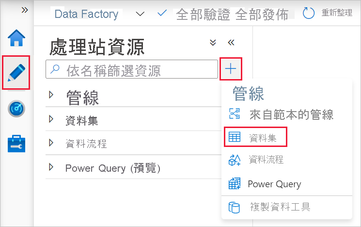
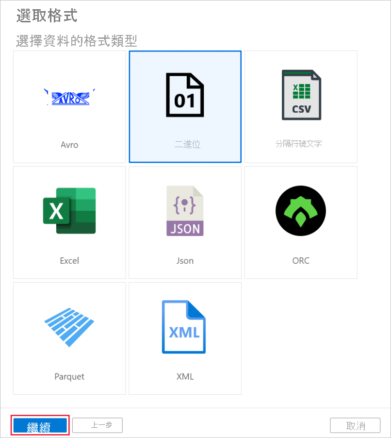
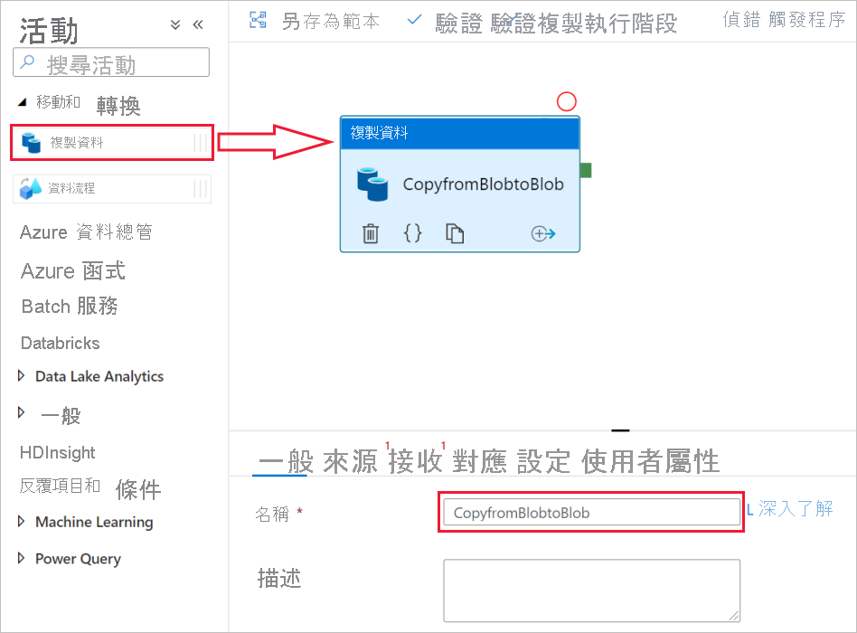

# 快速入門：使用 Azure Data Factory UI 建立資料處理站 

> [!div class="op_single_selector" title1="選取您目前使用的 Data Factory 服務版本："]
> * [第 1 版](v1/data-factory-copy-data-from-azure-blob-storage-to-sql-database.md)
> * [目前的版本](quickstart-create-data-factory-portal.md)

[!INCLUDE[appliesto-adf-xxx-md](includes/appliesto-adf-xxx-md.md)]

本快速入門說明如何使用 Azure Data Factory UI 建立及監視資料處理站。 在此資料處理站中建立的管線會將資料從 Azure Blob 儲存體中的一個資料夾「複製」到其他資料夾。 若要使用 Azure Data Factory 轉換資料，請參閱[對應資料流](concepts-data-flow-overview.md)和[整頓資料流 (預覽)](wrangling-data-flow-overview.md)。

> [!NOTE]
> 如果您不熟悉 Azure Data Factory，在執行此快速入門之前，請先參閱 [Azure Data Factory 簡介](introduction.md)。 

[!INCLUDE [data-factory-quickstart-prerequisites](../../includes/data-factory-quickstart-prerequisites.md)] 

### 影片 
觀賞這段影片，可協助您瞭解 Data Factory UI： 
>[!VIDEO https://channel9.msdn.com/Shows/Azure-Friday/Visually-build-pipelines-for-Azure-Data-Factory-v2/Player]

## 建立 Data Factory

1. 啟動 **Microsoft Edge** 或 **Google Chrome** 網頁瀏覽器。 目前，只有 Microsoft Edge 和 Google Chrome 網頁瀏覽器支援 Data Factory UI。
1. 移至 [Azure 入口網站](https://portal.azure.com)。 
1. 從 Azure 入口網站功能表選取 [建立資源]。
1. 選取 [整合]，然後選取 [Data Factory]。 
   
   ![在 [新增] 窗格中選取資料處理站](./media/doc-common-process/new-azure-data-factory-menu.png)
1. 在 [建立 Data Factory] 頁面的 [基本資料] 索引標籤下，選取您要在其中建立資料處理站的 Azure **訂用帳戶**。
1. 針對 [資源群組]，採取下列其中一個步驟︰

    a. 從下拉式清單中選取現有的資源群組。

    b. 選取 [建立新的] ，然後輸入新資源群組的名稱。
    
    若要了解資源群組，請參閱[使用資源群組管理您的 Azure 資源](../azure-resource-manager/management/overview.md)。 

1. 針對 [區域]，選取資料處理站的位置。

   清單只會顯示 Data Factory 支援的位置，以及儲存您 Azure Data Factory 中繼資料的位置。 Data Factory 所使用的相關聯資料存放區 (如 Azure 儲存體和 Azure SQL Database) 和計算 (如 Azure HDInsight) 可在其他區域中執行。
 
1. 針對 [名稱]，輸入 **ADFTutorialDataFactory**。
   Azure Data Factory 的名稱必須是 *全域唯一的*。 如果您看到下列錯誤，請變更資料處理站的名稱 (例如 **&lt;yourname&gt;ADFTutorialDataFactory**)，然後試著重新建立。 如需 Data Factory 成品的命名規則，請參閱 [Data Factory - 命名規則](naming-rules.md)一文。
  
   

1. 針對 [版本]  ，選取 [V2]  。

1. 完成時，選取 [下一步:Git 組態]，接著選取 [稍後設定 Git] 核取方塊。

1. 選取 [檢閱 +建立]，然後在通過驗證後選取 [建立]。 在建立完成後，選取 [前往資源]，以瀏覽至 [資料處理站] 頁面。 

1. 選取 [編寫與監視] 圖格，以在個別的瀏覽器索引標籤上啟動 Azure Data Factory 使用者介面 (UI) 應用程式。
   
   ![資料處理站的首頁，具有 [編寫與監視] 圖格](./media/doc-common-process/data-factory-home-page.png)
   
   > [!NOTE]
   > 如果您看到網頁瀏覽器停滯在「授權中」，請清除 [封鎖第三方 Cookie 和網站資料] 核取方塊。 或讓其保持在選取狀態，但為 **login.microsoftonline.com** 建立例外，然後再次嘗試開啟應用程式。
   

## 建立連結的服務
在此程序中，您會建立連結服務，將 Azure 儲存體帳戶連結至資料處理站。 連結的服務具有連線資訊，可供 Data Factory 服務在執行階段中用來連線。

1. 在 Azure Data Factory UI 頁面的左側窗格中，開啟 [[管理]](./author-management-hub.md)。

1. 在 [連結的服務] 頁面上，選取 [+ 新增] 以建立新的連結服務。

   
   
1. 在 [新增連結服務] 頁面上，選取 [Azure Blob 儲存體]，然後選取 [繼續]。 

1. 在 [新增連結服務 (Azure Blob 儲存體)] 頁面上，完成下列步驟： 

   a. 針對 [名稱]，輸入 **AzureStorageLinkedService**。

   b. 針對 [儲存體帳戶名稱] ，選取您 Azure 儲存體帳戶的名稱。

   c. 選取 [測試連線]，以確認 Data Factory 服務可連線至儲存體帳戶。 

   d. 選取 [建立] 以儲存連結服務。 

      

## 建立資料集
在此程序中，您會建立兩個資料集：**InputDataset** 和 **OutputDataset**。 這些資料集的類型為 **AzureBlob**。 其會參考您在前一節中建立的 Azure 儲存體連結服務。 

輸入資料集代表輸入資料夾中的來源資料。 在輸入資料集定義中，您可以指定 Blob 容器 (**adftutorial**)、資料夾 (**input**) 以及包含來源資料的檔案 (**emp.txt**)。 

此輸出資料集代表已複製到目的地的資料。 在輸出資料集定義中，您可以指定要將資料複製過去的 Blob 容器 (**adftutorial**)、資料夾 (**output**) 和檔案。 每個管線執行都有其相關聯的唯一識別碼。 您可以使用系統變數 **RunId** 來存取此識別碼。 輸出檔案的名稱會根據管線的執行識別碼進行動態評估。   

在連結服務設定中，您已指定包含來源資料的 Azure 儲存體帳戶。 在來源資料集設定中，您可以指定來源資料確切的所在位置 (Blob 容器、資料夾和檔案)。 在接收資料集設定中，您可以指定要將資料複製過去的位置 (Blob 容器、資料夾和檔案)。 

1. 從左側窗格中選取 [編寫] 索引標籤。

1. 選取 **+** (加號) 按鈕，然後選取 [資料集]。

   

1. 在 [新增資料集] 頁面上，選取 [Azure Blob 儲存體]，然後選取 [繼續]。 

1. 在 [選取格式] 頁面上，選擇您資料的格式類型，然後選取 [繼續]。 在此情況下，如果您不剖析內容而原封不動地複製檔案，請選取 [二進位]。

   
   
1. 在 [設定屬性] 頁面上，完成下列步驟：

    a. 在 [名稱] 下，輸入 **InputDataset**。 

    b. 針對 [連結服務]，選取 [AzureStorageLinkedService]。

    c. 針對 [檔案路徑]，選取 [瀏覽] 按鈕。

    d. 在 [選擇檔案或資料夾] 視窗中，瀏覽至 **adftutorial** 容器中的 **input** 資料夾，選取 **emp.txt** 檔案，然後選取 [確定]。
    
    e. 選取 [確定]。   

    
1. 重複前述步驟，以建立輸出資料集：  

    a. 選取 **+** (加號) 按鈕，然後選取 [資料集]。

    b. 在 [新增資料集] 頁面上，選取 [Azure Blob 儲存體]，然後選取 [繼續]。

    c. 在 [選取格式] 頁面上，選擇您資料的格式類型，然後選取 [繼續]。

    d. 在 [設定屬性] 頁面上，指定 **OutputDataset** 作為名稱。 選取 [AzureStorageLinkedService] 作為連結服務。

    e. 在 [檔案路徑] 下，輸入 **adftutorial/output**。 如果 **output** 資料夾不存在，則複製活動會在執行階段進行建立。

    f. 選取 [確定]。   

    

## 建立管線 
在此程序中，您會建立並驗證管線，其中含有使用輸入和輸出資料集的複製活動。 複製活動會將資料從您在輸入資料集設定中指定的檔案，複製到您在輸出資料集設定中指定的檔案。 如果輸入資料集僅指定資料夾 (而不是檔案名稱)，則複製活動會將來源資料夾中的所有檔案複製到目的地。 

1. 選取 **+** (加號) 按鈕，然後選取 [管線]。 

1. 在 [屬性] 底下的 [一般] 面板中，針對 [名稱] 指定 **CopyPipeline**。 然後按一下右上角的屬性圖示來摺疊面板。

1. 在 [活動] 工具箱中，展開 [移動和轉換]。 將 [活動] 工具箱中的 [資料複製] 活動拖到管線設計工具介面。 您也可以在 [活動] 工具箱中搜尋活動。 指定 **CopyFromBlobToBlob** 作為 [名稱]。

   

1. 在複製活動設定中切換至 [來源] 索引標籤，然後選取 **InputDataset** 作為 [來源資料集]。

1. 在複製活動設定中切換至 [接收] 索引標籤，然後選取 **OutputDataset** 作為 [接收資料集]。

1. 在畫布上方的管線設定上按一下 [驗證]，以驗證管線設定。 確認管線已驗證成功。 若要關閉驗證輸出，請選取右上角的 [驗證] 按鈕。 

   

## 偵錯管線
在此步驟中，您將在管線部署至 Data Factory 之前對其進行偵測。 

1. 在畫布上方的 [管線] 工具列上，按一下 [偵錯] 以觸發的測試回合。 
    
1. 確認您在底部管線設定的 [輸出] 索引標籤上，可檢視管線執行的狀態。 
 
    

1. 確認您在 **adftutorial** 容器的 **output** 資料夾中看到輸出檔案。 如果 output 資料夾不存在，Data Factory 服務會自動加以建立。 

## 手動觸發管線
在此程序中，您會將實體 (連結服務、資料集和管線) 部署至 Azure Data Factory。 然後，您會手動觸發管線執行。 

1. 觸發管線之前，您必須將實體發佈至 Data Factory。 若要發佈，請選取頂端的 [全部發佈]。 

    

1. 若要手動觸發管線，請選取管線工具列上的 [新增觸發程序]，然後選取 [立即觸發]。 在 [管線執行] 頁面上，選取 [確定]。

## 監視管線

1. 切換至左側的 [監視] 索引標籤。 使用 [重新整理] 按鈕可重新整理清單。

   
1. 選取 **CopyPipeline** 連結，您會在此頁面上看到複製活動執行的狀態。 

1. 若要檢視關於複製作業的詳細資訊，請選取 [詳細資料] (眼鏡圖示) 連結。 如需屬性的詳細資訊，請參閱[複製活動概觀](copy-activity-overview.md)。 

   
1. 確認您在 **output** 資料夾中看到新的檔案。 
1. 您可以選取 [所有管線執行] 連結，從 [活動執行] 檢視切換回 [管線執行] 檢視。 

## 觸發排程上的管線
此程序是本教學課程的選擇性程序。 您可以建立 *排程器觸發程序*，將管線排定為定期執行 (每小時、每天等)。 在此程序中，您會建立一個觸發程序，在您指定的結束日期和日期以前，該觸發程序會每分鐘執行一次。 

1. 切換至 [編寫] 索引標籤。 

1. 移至您的管線，選取管線工具列上的 [新增觸發程序]，然後選取 [新增/編輯]。 

1. 在 [新增觸發程序] 頁面上，選取 [選擇觸發程序]，然後選取 [新增]。 

1. 在 [新增觸發程序] 頁面上，在 [結束] 底下選取 [日期]，將結束時間指定為目前時間之後的幾分鐘，然後選取 [確定]。 

   每次執行管線都會產生相關成本，因此，請將結束時間指定為開始時間的數分鐘之後。 請確定兩者是在同一天。 不過，請確定發佈時間與結束時間之間有足夠的時間可供管線執行。 在您將方案發佈至 Data Factory 之後，觸發程序才會生效，而不是在您將觸發程序儲存在 UI 時生效。 

1. 在 [新增觸發程序] 頁面上，選取 [已啟用] 核取方塊，然後選取 [確定]。 

   
1. 檢閱警告訊息，然後選取 [確定]。

1. 選取 [全部發佈]，將變更發佈至 Data Factory。 

1. 切換至左側的 [監視] 索引標籤。 選取 [重新整理] 即可重新整理清單。 在發佈時間到結束時間之間，您會看到管線每隔一分鐘執行一次。 

   請留意 [觸發者] 資料行中的值。 手動觸發程序執行來自於您先前完成的步驟 (**立即觸發**)。 

1. 切換至 [觸發程序執行] 檢視。 

1. 確認在指定的結束日期和時間之前，每次執行管線時都會在 **output** 資料夾中建立一個輸出檔案。 

## 後續步驟
此範例中的管線會將資料從 Azure Blob 儲存體中的一個位置複製到其他位置。 若想了解使用 Data Factory 的更多案例，請瀏覽[教學課程](tutorial-copy-data-portal.md)。
