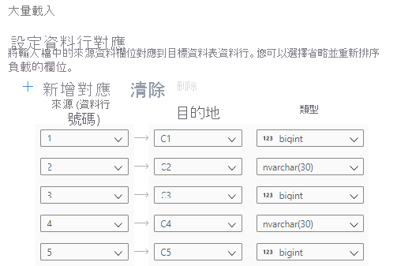

# 快速入門：使用 Synapse Studio 進行大量載入

使用 Synapse Studio 中的大量載入精靈可以輕鬆載入資料。 Synapse Studio 是 Azure Synapse Analytics 的一項功能。 大量載入精靈會引導您使用 [COPY 陳述式](/sql/t-sql/statements/copy-into-transact-sql?view=azure-sqldw-latest&preserve-view=true)建立 T-SQL 指令碼，以將資料大量載入專用 SQL 集區中。 

## 大量載入精靈的進入點

您可以用滑鼠右鍵按一下 Synapse Studio 內的下列區域，以大量載入資料：Azure 儲存體帳戶中連結至工作區的檔案或資料夾。

## 必要條件

- 精靈會產生使用 Azure Active Directory (Azure AD) 傳遞進行驗證的 COPY 陳述式。 [Azure AD 使用者必須可存取](./sql-data-warehouse/quickstart-bulk-load-copy-tsql-examples.md#d-azure-active-directory-authentication)至少具有Azure Data Lake Storage Gen2 帳戶的儲存體 Blob 資料參與者 Azure 角色的工作區。 

- 如果您要建立要作為載入目的地的新資料表，則必須擁有所需的 [COPY 陳述式使用權限](/sql/t-sql/statements/copy-into-transact-sql?view=azure-sqldw-latest&preserve-view=true#permissions)和建立資料表權限。

- 與 Data Lake Storage Gen2 帳戶相關聯的連結服務，*必須能夠存取要載入的檔案或資料夾*。 例如，如果連結服務的驗證機制是受控識別，則工作區受控識別必須至少有儲存體帳戶的儲存體 Blob 資料讀者權限。

- 如果您的工作區已啟用虛擬網路，請確定與來源資料和錯誤檔案位置的 Data Lake Storage Gen2 帳戶連結服務相關聯的整合式執行階段已啟用互動式製作。 自動結構描述偵測、預覽來源檔案內容，以及在精靈內瀏覽 Data Lake Storage Gen2 儲存體帳戶，都需要互動式製作功能。

## 步驟

1. 在 [來源儲存位置] 面板中，選取儲存體帳戶和您要載入的檔案或資料夾。 精靈會自動嘗試偵測 Parquet 檔案及分隔的文字 (CSV) 檔案，包括將檔案中的來源欄位對應到適當的目標 SQL 資料類型。 

   

2. 選取檔案格式設定，包括當大量載入期間有拒絕的資料列時所用的錯誤設定。 您也可以選取 [預覽資料] 來查看 COPY 陳述式會如何剖析檔案，以協助您設定檔案格式設定。 每當您變更檔案格式設定時，請選取 [預覽資料]，以查看 COPY 陳述式會如何使用更新後的設定來剖析檔案。

    

   > [!NOTE]  
   >
   > - 大量載入精靈不支援預覽具有多字元欄位結束字元的資料。 當您指定多字元欄位結束字元時，此精靈將會預覽單一資料行內的資料。 
   > - 選取 [推斷資料行名稱] 時，大量載入精靈會從 [第一個資料列] 欄位所指定第一個資料列中剖析資料行名稱。 大量載入精靈會自動將 COPY 陳述式中的 `FIRSTROW` 值加上 1，以忽略此標題資料列。 
   > - 在 COPY 陳述式中支援指定多字元資料列結束字元。 但大量載入精靈則不支援，且會擲回錯誤。

3. 選取您要用來載入的專用 SQL 集區，包括載入的標的是現有資料表還是新資料表。
   
4. 選取 [設定資料行對應]，以確定您具有適當的資料行對應。 請注意，如果您已啟用 [推斷資料行名稱]，則會自動偵測資料行名稱。 在新的資料表中，設定資料行對應對更新目標資料行資料類型而言，是很重要的。

   
5. 選取 [開啟指令碼]。 這會產生 T-SQL 指令碼，其中包含要從資料湖載入的 COPY 陳述式。
   

## 後續步驟

- 如需 COPY 功能的詳細資訊，請參閱 [COPY 陳述式](/sql/t-sql/statements/copy-into-transact-sql?view=azure-sqldw-latest&preserve-view=true#syntax)一文。
- 如需使用擷取、轉換和載入 (ETL) 程序的相關資訊，請參閱[資料載入概觀](./sql-data-warehouse/design-elt-data-loading.md#what-is-elt)一文。
